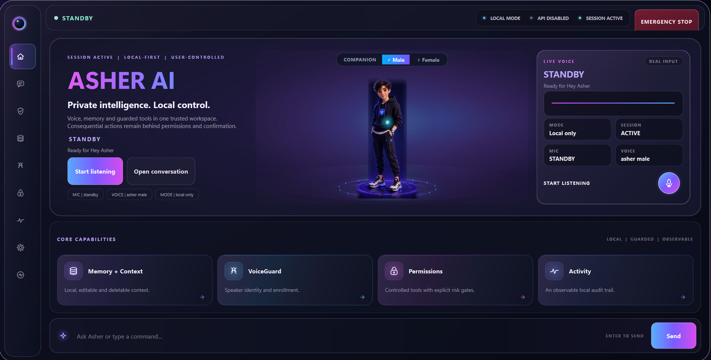
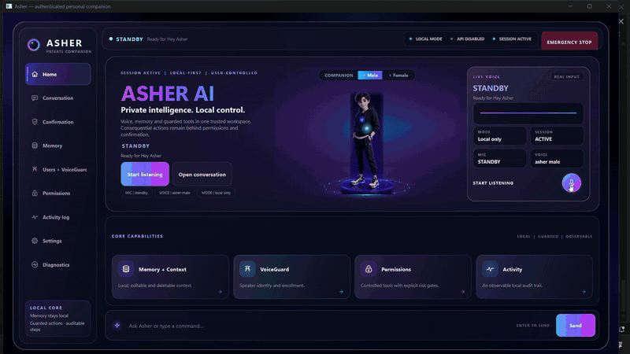
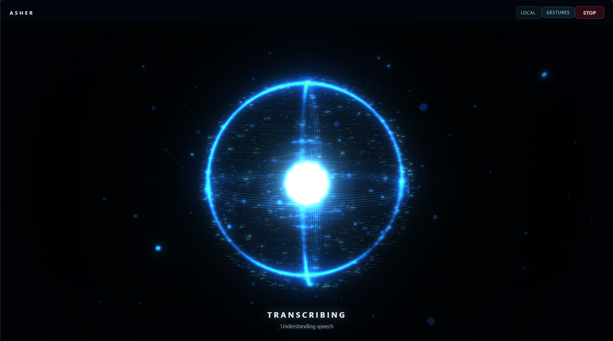

# ASHER

**A local-first AI companion for Windows.**

<p align="center">
  
</p>

## Demo

<p align="center">
  
</p>

▶ **[Watch the full ASHER demo](docs/assets/asher-demo.mp4)**

The demo shows ASHER transitioning from the Workspace into Companion Mode during live voice interaction.

ASHER is an experimental desktop AI agent built around natural voice interaction, local inference, controlled system actions, and a cinematic companion interface.

Rather than functioning only as a chatbot, ASHER is being designed as a persistent desktop companion that can listen, reason, interact with Windows, and respond through voice while keeping core processing and personal data local.

> **Status:** Active development

---

## Overview

ASHER combines a traditional desktop workspace with an immersive voice interaction mode.

### Workspace
A desktop control surface for interacting with and managing ASHER.

### Companion Mode
When active voice interaction begins, ASHER transitions into a cinematic WebGL companion interface with visual states for listening, processing, and speaking.

The interface is designed to feel like a native AI system rather than a conventional chatbot window.

---

## Current Capabilities

- Wake phrase activation using **"Hey Asher"**
- Local speech-to-text
- Local LLM-based conversation and planning
- Text-to-speech responses
- Windows application launching
- Google and YouTube search
- Screenshot capture
- Volume controls
- Basic WhatsApp workflows
- Standby / active voice states
- Presentation states for:
  - Listening
  - Transcribing
  - Thinking
  - Speaking
  - Error / stopped states
- Cinematic WebGL companion interface
- Desktop management workspace
- Local-first architecture

---

## Architecture

```text
                 ┌─────────────────────┐
                 │      User Voice     │
                 └──────────┬──────────┘
                            │
                            ▼
                 ┌─────────────────────┐
                 │    Wake Detection   │
                 └──────────┬──────────┘
                            │
                            ▼
                 ┌─────────────────────┐
                 │   Speech-to-Text    │
                 │   Faster-Whisper    │
                 └──────────┬──────────┘
                            │
                            ▼
                 ┌─────────────────────┐
                 │   ASHER Controller  │
                 └───────┬─────┬───────┘
                         │     │
                  ┌──────▼─┐ ┌─▼────────────┐
                  │ Local  │ │ Typed Tools  │
                  │  LLM   │ │ / Actions    │
                  └──────┬─┘ └──────┬───────┘
                         │           │
                         └─────┬─────┘
                               ▼
                    ┌─────────────────────┐
                    │        TTS          │
                    └──────────┬──────────┘
                               │
                               ▼
                    ┌─────────────────────┐
                    │ Companion / UI      │
                    └─────────────────────┘
```

---

## Tech Stack

| Component | Technology |
| --- | --- |
| Core | Python 3.12 |
| Desktop UI | PySide6 |
| Local LLM | Ollama + Qwen3.5 |
| Speech Recognition | Faster-Whisper |
| Visual Companion | Three.js / WebGL |
| Browser Integration | Qt WebEngine |
| Testing | Pytest |
| Platform | Windows 11 |

---

## Local-First Design

ASHER is being developed around a local-first approach.

Core goals include:

- Local AI inference where practical
- Local storage for private user data
- Controlled and explicit system actions
- Typed tools instead of unrestricted shell execution
- Clear separation between conversation and authorization
- User-controlled memory and preferences

Cloud services should not be required for ASHER's core conversational workflow.

---

## Safety Model

ASHER separates **identity, conversation, and authorization**.

Voice recognition alone is not intended to authorize sensitive actions.

Higher-risk actions are designed to require stronger confirmation and deterministic permission checks rather than relying on an LLM decision.

---

## UI

ASHER currently uses two primary interaction surfaces.

### Workspace

The Workspace provides access to ASHER's controls, status, capabilities, settings, and interaction history.

### Companion

During active voice conversations, the Workspace transitions into a dedicated cinematic companion scene.

<p align="center">
  
</p>

The Companion renderer is local and built using WebGL.

Visual state remains presentation-only — the UI itself does not authorize or execute actions.

---

## Project Structure

```text
ASHER/
│
├── asher/
│   ├── core/
│   ├── ui/
│   │   ├── home_companion/
│   │   ├── web_orb/
│   │   ├── controller.py
│   │   ├── orb_widget.py
│   │   └── window.py
│   │
│   └── ...
│
├── tests/
├── RUN_ASHER.md
├── PROJECT_PROGRESS.md
└── README.md
```

---

## Running ASHER

ASHER is currently under active development and is primarily tested on Windows.

Detailed local setup and launch instructions are maintained in:

```text
RUN_ASHER.md
```

The project requires local dependencies such as Python, Ollama, the configured local language model, speech-recognition dependencies, and PySide6.

---

## Testing

Focused tests can be executed with:

```powershell
python -m pytest tests -q
```

The repository also includes the project test runner:

```powershell
.\run_tests.ps1
```

---

## Development Roadmap

Current and future areas of development include:

- Improved conversation reliability
- Voice identity / VoiceGuard
- Permission and authorization layers
- Persistent editable memory
- Preference learning
- More Windows tools
- Better task planning and recovery
- Cross-device interaction
- Android companion support
- Performance and resource optimization

---

## Design Philosophy

ASHER is built around a simple idea:

> **An AI companion should understand, assist and act — without taking control away from the user.**

The project prioritizes:

**Local-first processing · Explicit control · Natural interaction · Reliability · Privacy**

---

## Project Status

ASHER is **not a finished product**.

It is an ongoing personal engineering project used to explore local AI agents, human-computer interaction, speech systems, desktop automation, UI engineering, and safe tool execution.

Some components shown in the repository may still be experimental.

---

## Author

**Mohammed Yazer**

B.Tech Artificial Intelligence & Data Science

GitHub: [mohammedyazer755-svg](https://github.com/mohammedyazer755-svg)

---

## License

A license has not yet been selected for this project.

Until one is added, the source code remains under the author's default copyright.